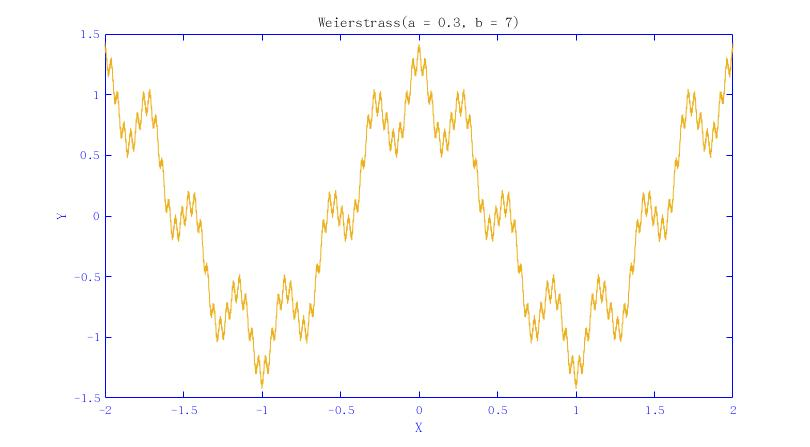
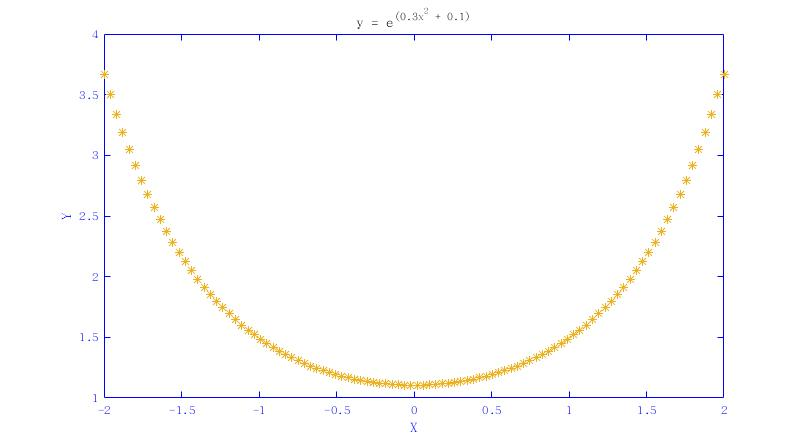
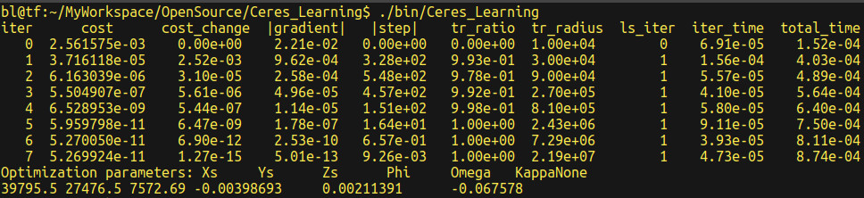

# Ceres Learning
## 1 练练手

### 1.1 非约束最优化问题

$${\arg \min}_{x} f(x)=\frac{1}{2}(10-x)^{2}  \tag{1}$$

**步骤**

​	（1）编写CostFunction结构体。必须重载运算符()，必须使用模板类型，所有输入参数和输出参数都使用模板类型。

​	（2）构造一个求解非线性最小二乘法的Problem来进行未知数求解。

### 1.2 曲线拟合

**（1）魏尔斯特拉斯函数(Weierstrass function)**
$$f(x)=\sum_{n=0}^{N}a^{n}cos(b^{n} \pi x) \tag{2}$$

​	其中$0<a<1$，$b$为正奇数，且满足$ab>1+\frac{3}{2} \pi$

**（2）Weierstrass图像绘制**

**（3）步骤**

​	（3.1）构造数据。设置参数$a=0.3, b=7, n=200$ 。

​	（3.2）编写CostFunction结构体。

​	（3.3）构造一个求解非线性最小二乘法的Problem来进行未知数求解。

**（4）总结**

​	（4.1）利用ceres无法对非线性函数进行曲线拟合，如魏尔斯特拉斯函数。原因包括两点：函数无法进行微分求解和初始点难以选取。

​	（4.2）此处改为ceres对$y=e^{ax^{2}+b}$函数进行曲线拟合，其中 $a=0.3, b=0.1$ 。该函数图如下所示：

​	（4.3）可以采用三种方法对问题进行求解，即：在进行Problem构建时，采用AutoDiffCostFunction或NumericDiffCostFunction进行数值微分求解；当无法使用模板来创建costfunctor时，继承SizedCostFunction类来实现Problem。

### 1.3 单像空间后方交会问题

**（1）共线方程**

$$\begin{equation} \begin{split} \left\{ \begin{array}{} x-x_{0}=- f\frac{a_{1}(X-X_{s})+b_{1}(Y-Y_{s})+c_{1}(Z-Z_{s})}{a_{3}(X-X_{s})+b_{3}(Y-Y_{s})+c_{3}(Z-Z_{s})}, & \\ y-y_{0}=-f \frac{a_{2}(X-X_{s})+b_{2}(Y-Y_{s})+c_{2}(Z-Z_{s})}{a_{3}(X-X_{s})+b_{3}(Y-Y_{s})+c_{3}(Z-Z_{s})} \end{array}  \right. \end{split} \tag{3} \end{equation}$$

​	其中$x_{0}, y_{0}, f$已知，$abc$为旋转矩阵，可以利用$\phi, \omega, \kappa$表示如下：

$$\begin{equation} \begin{split} \left\{ \begin{array}{} a_{1}=cos\phi cos\kappa -sin\phi sin\omega sin\kappa, & \\ a_{2}=-cos\phi sin\kappa -sin\phi sin\omega cos\kappa, & \\ a_{3}=-sin\phi cos\omega, & \\ b_{1}=cos\omega sin\kappa, & \\ b_{2}=cos\omega cos\kappa, & \\ b_{3}=-sin\omega, & \\ c_{1}=sin\phi cos\kappa +cos\phi sin\omega sin\kappa, & \\c_{2}=-sin\phi sin\kappa +cos\phi sin\omega cos\kappa, & \\ c_{3}=cos\phi cos\omega \end{array}  \right. \end{split} \tag{4} \end{equation}$$

**（2）步骤**

​	（2.1）读入数据，格式为$(x, y, X, Y, Z)$ 。前2维像素坐标—单位$mm$ ，后三维代像坐标—单位$m$ 。

​	（2.2）编写CostFunction结构体。

​	（2.3）构造一个求解非线性最小二乘法的Problem来进行未知数求解。

**（3）运行结果**

### 1.4 Powell's Quartic Function

**（1）数学表达式**

$$f(X)=\left(x_1+10x_2\right)^2+5\left(x_3-x_4\right)^2+\left(x_2-2x_3\right)^4+10\left(x_1-x_4\right)^4 \tag{5}$$

​	其中：

​	$\bullet -10\leq x_i\leq 10, i=1,2,3,4$

​	$\bullet f_{min}(X^*)=0$

​	$\bullet x^*_i=0$

**（2）Powell's Quartic Function分解**

$$\begin{equation} \begin{split} f_{1}(x)&=x_{1}+10x_{2} \\ f_{2}(x)&=\sqrt{5}(x_{3}-x_{4})  \\ f_{3}(x)&=(x_{2}-2x_{3})^{2}  \\ f_{4}(x)&=\sqrt{10}(x_{1}-x_{4})^{2}  \\ F(x)&=[f_{1}(x), f_{2}(x), f_{3}(x), f_{4}(x)] \end{split} \end{equation} \tag{6}$$

**（3）最优化问题数学描述**

$${\arg \min}_{x} \frac{1}{2} \|F(x)\|^{2} \tag{7}$$

